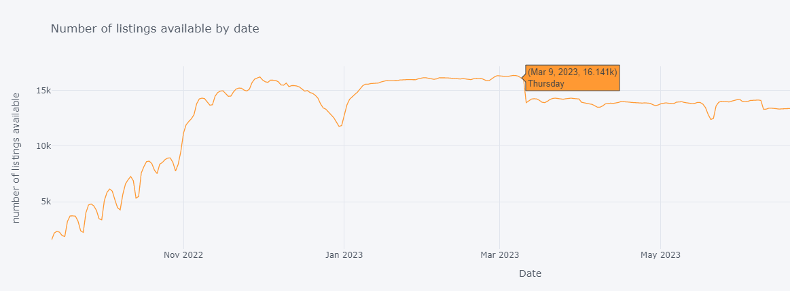

🇪🇸
[Español](#Español)
[Español](#Español)

# Español 

## Introducción

El objetivo de este proyecto es llevar a cabo un análisis exploratorio exhaustivo de los datos proporcionados por Airbnb en la ciudad de Roma. El objetivo principal es entender el mercado de alquiler de viviendas en la ciudad, identificar patrones y obtener información valiosa a partir de los datos.

Roma es una ciudad turística muy popular, visitada por millones de turistas cada año. Como resultado, el mercado de alquiler de viviendas se ha expandido significativamente en la ciudad, con un gran número de propiedades disponibles en Airbnb. A través del análisis de los datos de Airbnb en la ciudad de Roma, podemos obtener información valiosa sobre la oferta y demanda de viviendas en la ciudad, así como también sobre las características de las viviendas y las áreas en las que se encuentran.

Este análisis puede ser útil para propietarios de alojamientos en la ciudad, así como también para el público en general que busca información sobre el mercado de alquiler de viviendas en Roma. Al entender mejor el mercado, los propietarios pueden tomar decisiones informadas sobre el precio y la oferta de sus propiedades, mientras que los turistas pueden usar esta información para encontrar la mejor opción de alojamiento en la ciudad.

## Ejemplos de gráficas y visualizaciones del análisis de datos de Airbnb en Roma

Se presentan algunos ejemplos de las gráficas y visualizaciones generadas a partir del análisis de datos de Airbnb en Roma. Estas visualizaciones proporcionan una mejor comprensión del mercado de alquiler de viviendas en la ciudad y pueden ser útiles para aquellos interesados en el tema.

### Mapa interactivo de las ubicaciones.

### Mapa interactivo del precio medio de los alojamientos para grupos de 4 personas.

### Gráfico interactivo de la disponibilidad en el tiempo.

### ¡Gracias por explorar los datos de Airbnb en Roma!

Espero que este proyecto sea de utilidad para aquellos interesados en el mercado de alquiler de viviendas en la ciudad de Roma. Siéntete libre de explorar los datos y utilizar los gráficos y visualizaciones para obtener una mejor comprensión del mercado.

