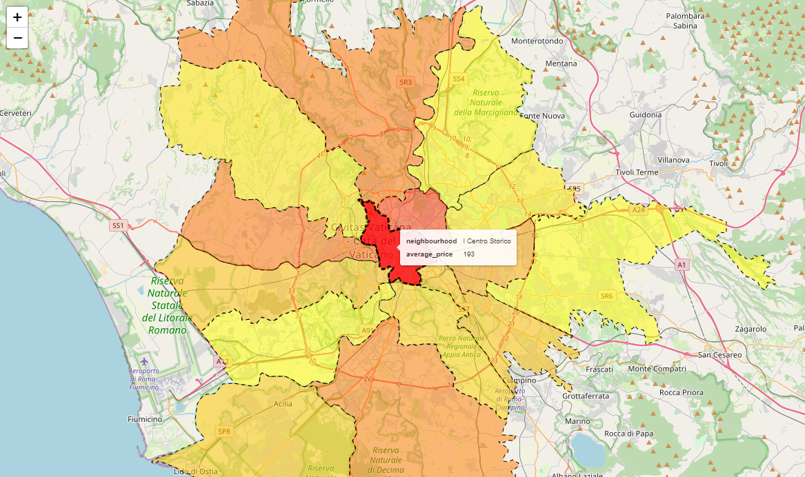

[Español](#Español)

[English](#English)

# Español 

## Introducción

El objetivo de este proyecto es llevar a cabo un análisis exploratorio exhaustivo de los datos proporcionados por Airbnb en la ciudad de Roma. El objetivo principal es entender el mercado de alquiler de viviendas en la ciudad, identificar patrones y obtener información valiosa a partir de los datos.

Roma es una ciudad turística muy popular, visitada por millones de turistas cada año. Como resultado, el mercado de alquiler de viviendas se ha expandido significativamente en la ciudad, con un gran número de propiedades disponibles en Airbnb. A través del análisis de los datos de Airbnb en la ciudad de Roma, podemos obtener información valiosa sobre la oferta y demanda de viviendas en la ciudad, así como también sobre las características de las viviendas y las áreas en las que se encuentran.

Este análisis puede ser útil para propietarios de alojamientos en la ciudad, así como también para el público en general que busca información sobre el mercado de alquiler de viviendas en Roma. Al entender mejor el mercado, los propietarios pueden tomar decisiones informadas sobre el precio y la oferta de sus propiedades, mientras que los turistas pueden usar esta información para encontrar la mejor opción de alojamiento en la ciudad.

## Ejemplos de gráficas y visualizaciones del análisis de datos de Airbnb en Roma

Se presentan algunos ejemplos de las gráficas y visualizaciones generadas a partir del análisis de datos de Airbnb en Roma. Estas visualizaciones proporcionan una mejor comprensión del mercado de alquiler de viviendas en la ciudad y pueden ser útiles para aquellos interesados en el tema.

### Mapa interactivo de las ubicaciones.

### Mapa interactivo del precio medio de los alojamientos para grupos de 4 personas.

### Gráfico interactivo de la disponibilidad en el tiempo.

### ¡Gracias por explorar los datos de Airbnb en Roma!

Espero que este proyecto sea de utilidad para aquellos interesados en el mercado de alquiler de viviendas en la ciudad de Roma. Siéntete libre de explorar los datos y utilizar los gráficos y visualizaciones para obtener una mejor comprensión del mercado.

# English

## Introduction

The objective of this project is to conduct a comprehensive exploratory analysis of the data provided by Airbnb in the city of Rome. The main goal is to understand the housing rental market in the city, identify patterns, and obtain valuable information from the data.

Rome is a very popular tourist city, visited by millions of tourists each year. As a result, the housing rental market has expanded significantly in the city, with a large number of properties available on Airbnb. Through the analysis of Airbnb data in the city of Rome, we can obtain valuable information about the supply and demand of housing in the city, as well as the characteristics of the properties and the areas where they are located.

This analysis can be useful for accommodation owners in the city, as well as for the general public seeking information about the housing rental market in Rome. By better understanding the market, owners can make informed decisions about the pricing and supply of their properties, while tourists can use this information to find the best accommodation option in the city.

## Examples of Graphs and Visualizations from Airbnb Data Analysis in Rome

Here are some examples of graphs and visualizations generated from Airbnb data analysis in Rome. These visualizations provide a better understanding of the housing rental market in the city and can be useful for those interested in the topic.

### Interactive map of locations.

### Interactive map of average price for accommodations for groups of 4 people.

### Interactive chart of availability over time.

### Thank you for exploring Airbnb data in Rome!

I hope this project is useful for those interested in the housing rental market in the city of Rome. Feel free to explore the data and use the graphs and visualizations to gain a better understanding of the market.

